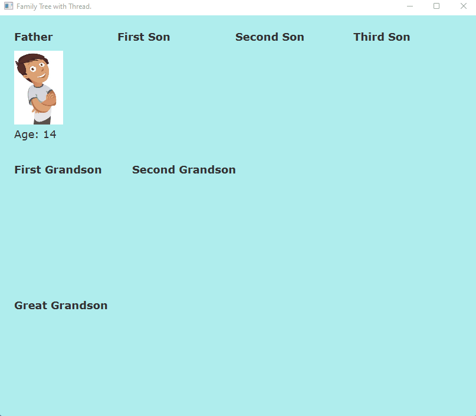

# Arvore-Genealogica

## Uma árvore genealógica com Threads em Java

* Java 8
* JavaFx

### Programa em execução

### Easter egg
Foi adicionado um uma referência ao Rick and Morty
Uma tela com esse gif é exibida quando o programa é finalizado, ou seja, quando todas as threads "morrem"

