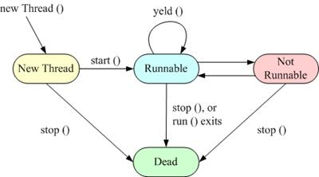

# Árvore genealógica - Trabalho 02 da disciplina de programação concorrente

## Salve salve, então você está cursando programação concorrente ministrada por Marlos em. 😂😂😂
## Se der estrela no repositório = humilde

## Uma árvore genealógica com Threads em Java

### Manipulação de threads em Java

- Implementação através da derivação da classe Thread

### Resumo sobre os threads em Java

- Principais métodos de manipulação
de threads

